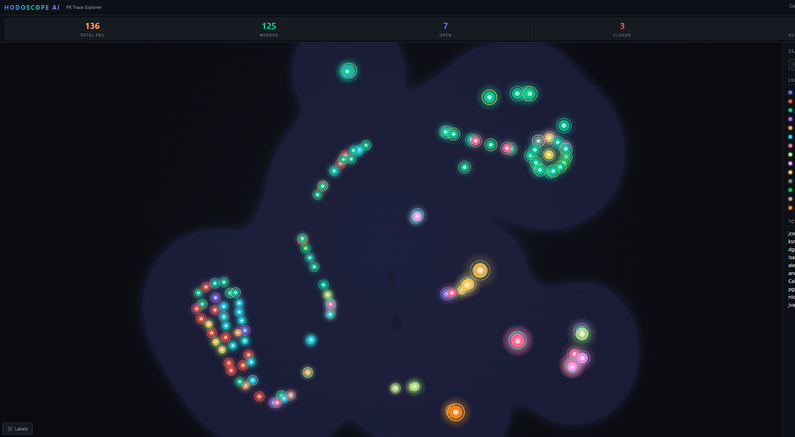

#  Hodoscope AI

### Visualize your org's PR history as an interactive particle map

> Created by **Caleb DeLeeuw** at **[Misfits & Machines](https://github.com/marketingarchitects)**
>
> Inspired by [Hodoscope](https://github.com/AR-FORUM/hodoscope) — unsupervised trajectory analysis for AI agents

---

**Hodoscope AI** turns pull request history into a living, breathing scatter plot. Each PR becomes a glowing point in a t-SNE-projected feature space — PRs with similar lifecycles cluster together naturally. The result looks like a particle physics bubble chamber, but it's your team's development flow.

**Works with GitHub + Azure DevOps. Runs in VS Code, Cursor, or standalone browser.**

## What it looks like

<p align="center">
  
</p>

*136 PRs across GitHub and Azure DevOps, projected into 2D via t-SNE. Each dot is a PR — color = author, ring = repo, size = event count. Density heatmap reveals behavioral clusters.*

- Dark canvas with **density heatmap** (Gaussian KDE) showing where PR activity concentrates
- **Glowing dots** sized by event count, colored by author/status/provider/repo
- **Repo indicator rings** always visible as a subtle outer band on each dot
- **Floating repo labels** at cluster centroids — click to highlight that repo's PRs
- **Author annotations** appear on highlighted dots so you see who worked on what
- Hover for rich tooltips, click for full detail panel, search/filter in sidebar

## Features

| Feature | Description |
|---------|-------------|
| **t-SNE Clustering** | PRs projected from 17-dim feature vectors (event count, code size, duration, collaboration metrics, status) into 2D clusters |
| **Multi-Provider** | GitHub (Octokit) + Azure DevOps (REST API) — see cross-provider patterns |
| **Multi-Org** | Fetch from multiple GitHub orgs simultaneously |
| **Color Modes** | Author, Status, Provider, Repo — switch instantly |
| **Repo Rings** | Always-visible outer ring shows repo membership regardless of color mode |
| **Click Repo Labels** | Highlights that repo's dots, dims everything else, shows author names |
| **Label Toggle** | Bottom-left button hides/shows floating repo labels |
| **Density Heatmap** | Gaussian KDE overlay reveals behavioral clusters |
| **Hover Tooltips** | PR title, author, repo, branch, status, changes, date |
| **Click Detail Panel** | Full PR metadata with link to open in browser |
| **Search & Filter** | Live text search + legend toggle to show/hide groups |
| **Manager Dashboard** | KPI cards: Total PRs, Merged, Open, Closed, Contributors |
| **Claude Code MCP** | Query PR data from your terminal via 4 MCP tools |
| **83 Tests** | TDD throughout — models, fetchers, visualization, extension |

## Quick Start

```bash
git clone https://github.com/CalebDeLeeuwMisfits/hodoscope-ai.git
cd hodoscope-ai
npm install
```

### Generate a scatter visualization

```bash
# Set your GitHub token (or use gh auth)
export GH_TOKEN=$(gh auth token)

# Optional: Azure DevOps
export AZDO_TOKEN=your-pat-here

# Run the demo
npx tsx scripts/demo-scatter.ts
# → Opens dist/scatter.html in your browser
```

### Run tests

```bash
npm test        # 83 tests, ~800ms
npm run test:watch
```

### Build the VS Code extension

```bash
npm run build:all
```

## Architecture

```
hodoscope-ai/
├── src/
│   ├── models/
│   │   ├── types.ts              # PRTrace, TraceEvent, ScatterPoint
│   │   ├── trace-builder.ts      # PR → TracePath, filtering, grouping, stats
│   │   └── projection.ts         # Feature extraction, PCA, t-SNE (pure TS)
│   ├── fetchers/
│   │   ├── github.ts             # Octokit: PRs + reviews + events + comments
│   │   └── azure-devops.ts       # AzDO REST: PRs + threads + iterations + votes
│   ├── webview/
│   │   ├── scatter-visualization.ts  # Hodoscope-style scatter plot (Canvas 2D)
│   │   └── visualization.ts         # Original timeline view
│   └── extension.ts              # VS Code/Cursor extension entry
├── claude-extension/
│   ├── server.ts                 # MCP server (4 tools)
│   └── hodoscope.md              # Claude Code slash command
├── scripts/
│   ├── demo-scatter.ts           # Multi-org t-SNE scatter demo
│   ├── demo-multi.ts             # Multi-repo timeline demo
│   └── demo.ts                   # Single-repo demo
└── 6 test files (83 tests)
```

## How the t-SNE works

Each PR is converted to a 17-dimensional feature vector:

| Feature Group | Dimensions |
|---------------|-----------|
| **Size** | event count, additions, deletions, total changes, changed files |
| **Time** | log(duration in hours) |
| **Collaboration** | reviewer count, label count, comments, reviews, commits, approvals |
| **Status** | merged, open, closed, draft (one-hot) |
| **Provider** | github flag |

These vectors are normalized to [0,1], then projected to 2D via t-SNE (pure TypeScript implementation, no dependencies). The result: PRs with similar lifecycle patterns naturally cluster together.

## Claude Code Integration

Add the MCP server to your Claude Code config:

```json
{
  "mcpServers": {
    "hodoscope": {
      "command": "node",
      "args": ["/path/to/hodoscope-ai/dist/mcp-server.js"],
      "env": { "GH_TOKEN": "your-token" }
    }
  }
}
```

**Available tools:**
- `hodoscope_list_prs` — List PRs with optional filters
- `hodoscope_pr_details` — Full event timeline for a specific PR
- `hodoscope_stats` — Aggregate repository statistics
- `hodoscope_timeline` — PR activity in a date range

## Acknowledgments

- [Hodoscope](https://github.com/AR-FORUM/hodoscope) by AR-FORUM — the original trajectory analysis tool that inspired this project
- Built with pure TypeScript — no D3, no WebGL, no external visualization dependencies

---

<p align="center">
  
  <br>
  <strong>Built by <a href="https://github.com/CalebDeLeeuwMisfits">Caleb DeLeeuw</a> at <a href="https://github.com/marketingarchitects">Misfits & Machines</a></strong>
</p>

## License

MIT
